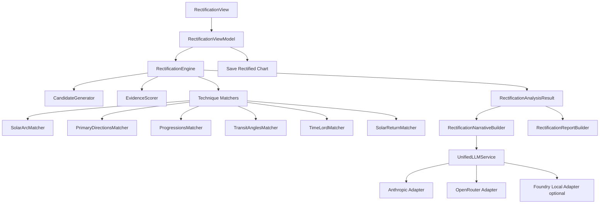

# Plan general de implementación — Rectificación de hora natal

**Proyecto:** AstroMalik macOS  
**Documento:** Plan técnico, astrológico y de producto para implementar rectificación de hora natal / Ascendente  
**Fecha:** 2026-06-10  
**Estado:** En ejecución — documento maestro y fuente de verdad

**Alcance:** Motor de rectificación asistida + UI + persistencia + integración LLM Anthropic/OpenRouter + ajustes unificados de IA

---

## 0. Control de ejecución

Este mismo documento se utilizará como **especificación, roadmap y registro de avance**. No se mantendrá un segundo plan paralelo. El código, los tests y los commits siguen siendo la prueba real de cada entrega; este bloque registra el estado y las decisiones para evitar que la implementación se desvíe del diseño.

### 0.1. Estado global

| Fase | Estado | Resultado verificable |
|---|---|---|
| Fase 0 — Fundamentos deterministas | ✅ Completada | Hora con segundos, modelos base y tests |
| Fase 1 — MVP determinista | ✅ Completada | Ranking explicable de horas candidatas sin LLM |
| Fase 2 — Narrativa LLM opcional | ✅ Completada | Comparación redactada con red y proveedor explícitos |
| Fase 3 — Persistencia e informes | ✅ Completada | Sesiones recuperables, PDF y Joplin manual |
| Fase 4 — Refinamiento profesional | ⬜ Pendiente | Clusters, lotes, time lords y configuración avanzada |

Estados permitidos: `⬜ Pendiente`, `🟦 En curso`, `🟨 Bloqueada`, `✅ Completada`.

### 0.2. Decisiones cerradas para el MVP

1. Nombre visible: **Rectificación**.
2. El MVP es **determinista y local-first**; no necesita proveedor LLM para calcular ni ordenar candidatas.
3. Resolución inicial de la UI: **un minuto**. El backend aceptará segundos para no cerrar la evolución posterior.
4. El LLM será una capa opcional de redacción/comparación en Fase 2 y nunca recalculará astronomía.
5. Las llamadas de red exigirán acción explícita del usuario, coherente con la política local-first del CLI.
6. Joplin y PDF se añadirán cuando el contrato del resultado determinista sea estable.
7. La candidata elegida se guardará como una carta nueva; nunca sobrescribirá silenciosamente la carta original.
8. No se calibrarán pesos con un único caso real. Los defaults se conservarán como configuración versionada y auditable.

### 0.3. Definition of Done global

Una tarea o fase solo puede marcarse como completada si:

- el código compila sin warnings nuevos relevantes;
- los tests nuevos y la suite existente pasan;
- los errores y cancelaciones dejan la UI en estado coherente;
- los resultados incluyen configuración, advertencias y evidencia reproducible;
- se actualizan este tracker y la documentación pública afectada;
- después de cambios Swift/UI se ejecuta `scripts/package_app.sh`;
- se verifica el timestamp de `AstroMalik.app/Contents/MacOS/AstroMalik`.

### 0.4. Checklist ejecutable por fases

#### Fase 0 — Fundamentos deterministas

- [x] `R0.1` Auditar todos los parseos de `birthTime` y definir compatibilidad `HH:mm` / `HH:mm:ss`.
- [x] `R0.2` Añadir segundos a `julianDayFromLocal` sin romper datos existentes.
- [x] `R0.3` Añadir tests de zona horaria, cambio de día y segundos.
- [x] `R0.4` Crear modelos base de sesión, evento, candidata, evidencia, configuración y resultado.
- [x] `R0.5` Definir errores de dominio y validación de rango/eventos.
- [x] `R0.6` Documentar contratos Codable y compatibilidad de persistencia.

#### Fase 1 — MVP determinista

- [x] `R1.1` Implementar generador coarse/fine con límites y cancelación.
- [x] `R1.2` Implementar reglas simbólicas centralizadas y versionadas.
- [x] `R1.3` Implementar scorers de arco solar y tránsitos a ángulos.
- [x] `R1.4` Añadir direcciones primarias y progresiones secundarias.
- [x] `R1.5` Consolidar, normalizar y explicar scores sin premiar volumen bruto.
- [x] `R1.6` Detectar clusters, empates, mesetas y resultados inconclusos.
- [x] `R1.7` Crear ViewModel con progreso, cancelación y errores.
- [x] `R1.8` Crear UI mínima y navegación.
- [x] `R1.9` Guardar candidata como carta nueva con procedencia de rectificación.
- [x] `R1.10` Validar con fixtures sintéticos y dos cartas de referencia independientes. La calibración biográfica real queda en R4.5 para evitar ajustar pesos con casos insuficientes.

#### Fase 2 — Narrativa LLM opcional

- [x] `R2.1` Definir contrato común de proveedor sin bloquear las fases deterministas.
- [x] `R2.2` Crear payload compacto y versionado desde `RectificationAnalysisResult`.
- [x] `R2.3` Crear prompt con prohibición explícita de inventar cálculos.
- [x] `R2.4` Añadir redacción Anthropic/OpenRouter solo bajo acción explícita.
- [x] `R2.5` Mostrar proveedor, modelo, tokens, coste estimado y errores.
- [x] `R2.6` Cubrir el flujo con clientes mock y snapshots estructurales.

#### Fase 3 — Persistencia e informes

- [x] `R3.1` Añadir migraciones SQLite para sesiones, eventos y resultados cacheados.
- [x] `R3.2` Reabrir, editar, recalcular y versionar sesiones.
- [x] `R3.3` Crear informe PDF técnico con candidatas, evidencia y advertencias.
- [x] `R3.4` Crear nota Joplin únicamente mediante acción explícita.
- [x] `R3.5` Añadir exportación/importación JSON versionada.

#### Fase 4 — Refinamiento profesional

- [ ] `R4.1` Integrar profecciones, Firdaria, ZR, lotes y revolución solar como confirmación.
- [ ] `R4.2` Añadir cuestionario preliminar de signo Ascendente.
- [ ] `R4.3` Añadir comparación de candidatas y gráfico de distribución.
- [ ] `R4.4` Añadir configuración avanzada de pesos, orbes y escuela doctrinal.
- [ ] `R4.5` Ejecutar análisis anti-overfitting y calibración con corpus de casos.

### 0.5. Registro de implementación

| Fecha | IDs | Estado | Evidencia / notas |
|---|---|---|---|
| 2026-07-10 | Plan | ✅ | Documento adoptado como tracker único; se separa el MVP determinista de la capa LLM opcional. |
| 2026-07-10 | R0.1–R0.6 | ✅ | Parser horario centralizado; 11 consumidores migrados; modelos y validación versionados; 364 tests, 1 skipped, 0 failures. |
| 2026-07-10 | R1.1–R1.10 | ✅ | Motor coarse/fine, cuatro scorers, consolidación anti-volumen, clusters, ViewModel, UI y guardado con procedencia. Validación: 371 tests, 1 skipped, 0 failures; app 23:09:13 CEST. |
| 2026-07-10 | R2.1–R2.6 | ✅ | Servicio LLM común, payload v1 compacto, prompt anti-invención, Anthropic/OpenRouter explícitos y trazabilidad. Validación: 373 tests, 1 skipped, 0 failures; app 23:43:40 CEST. |
| 2026-07-11 | R3.1–R3.5 | ✅ | Migración 007, store SQLite con historial deduplicado, reapertura/edición/recálculo, JSON v1, PDF técnico y Joplin explícito. Validación: 378 tests, 1 skipped, 0 failures; app 00:19:46 CEST. |

### 0.6. Riesgos que deben revisarse en cada fase

- Rendimiento al recalcular cientos de cartas y técnicas.
- Cancelación cooperativa de tareas largas.
- Inconsistencias entre parseadores de `birthTime` repartidos por varios motores.
- Sobreajuste por demasiadas técnicas, factores u orbes amplios.
- Resultados falsamente precisos cuando los eventos son pocos o aproximados.
- Cambios de secta, signo Ascendente o sistema de casas dentro del rango.
- Compatibilidad de sesiones persistidas cuando evolucionen pesos y reglas.

---

## 1. Resumen ejecutivo

La **rectificación de hora natal** es el proceso de afinar una hora de nacimiento incierta —y por tanto el Ascendente, Medio Cielo, cúspides, lotes y casas— comparando distintas horas candidatas contra sucesos biográficos conocidos del nativo.

La implementación recomendada para AstroMalik no debe presentarse como un “botón mágico” que descubre una verdad absoluta, sino como una herramienta profesional de **rectificación asistida**:

> AstroMalik calcula y ordena hipótesis horarias; el astrólogo valida, interpreta y decide.

El sistema debe combinar dos capas:

1. **Capa determinista astrológica**  
   Genera cartas candidatas dentro de un rango horario, calcula activaciones predictivas y puntúa su ajuste a los eventos aportados por el astrólogo.

2. **Capa interpretativa LLM**  
   Envía a Anthropic u OpenRouter un paquete estructurado con carta base, eventos, candidatas, evidencias, contradicciones y notas del astrólogo. El modelo no calcula posiciones; interpreta, compara, redacta y propone preguntas de seguimiento.

AstroMalik ya dispone de gran parte de la infraestructura necesaria:

- Swiss Ephemeris integrado.
- `NatalChart`, cartas guardadas y cálculo natal.
- Tránsitos.
- Progresiones secundarias.
- Direcciones primarias.
- Arco solar.
- Profecciones.
- Firdaria.
- Zodiacal Releasing.
- Joplin.
- Exportación PDF.
- Cliente Anthropic.
- Cliente OpenRouter.
- Ajustes con Keychain.
- Ejemplo ya existente de redacción LLM estructurada: `CrossPersonalNarrativeBuilder`.

Por tanto, el trabajo principal no es inventar toda la astrología desde cero, sino construir un **orquestador de rectificación**, una UI específica y una capa LLM común reutilizable.

---

## 2. Fuentes y criterios profesionales revisados

Durante la sesión se revisaron referencias actuales y prácticas profesionales. Conclusiones relevantes:

### 2.1. La rectificación es investigativa y especulativa

The Astrology Podcast describe la rectificación como un procedimiento usado cuando la hora natal es desconocida o incierta, y remarca que muchas técnicas —casas, Ascendente y timing— dependen de la hora exacta. También insiste en que es una de las tareas más difíciles de la astrología y que debe tratarse con cautela.

Referencia:  
<https://theastrologypodcast.com/2018/08/27/rectification-using-astrology-to-find-your-birth-time/>

### 2.2. Flujo profesional típico

Patrick Watson estructura el trabajo profesional como:

1. Buscar primero la hora por medios convencionales.
2. Evaluar si realmente hace falta rectificación.
3. Compilar una cronología de sucesos clave.
4. Analizar posibilidades natales.
5. Discutir el modelo con el consultante.
6. Probar, ajustar y hacer seguimiento.

Referencia:  
<https://patrickwatsonastrology.com/services/rectification/>

### 2.3. La cronología vital es esencial

Eventos útiles mencionados por astrólogos profesionales y debates técnicos:

- Matrimonio, divorcio, inicio/fin de relaciones importantes.
- Nacimiento de hijos o hermanos.
- Muertes familiares.
- Mudanzas.
- Compra/venta de vivienda.
- Graduaciones.
- Inicios/finales laborales.
- Ascensos.
- Cambios vocacionales.
- Accidentes.
- Cirugías.
- Enfermedades.
- Crisis psicológicas o pérdidas importantes.
- Viajes largos o cambio de país.
- Eventos públicos o de reputación.

En Skyscript se insiste en que es mejor tener eventos repartidos a lo largo de la vida que muchos eventos concentrados en un periodo corto.

Referencia:  
<https://skyscript.co.uk/forums/viewtopic.php?t=6531>

### 2.4. Técnicas principales

Kerykeion resume las técnicas más usadas para rectificación:

- Direcciones primarias.
- Arco solar.
- Progresiones secundarias.
- Tránsitos a ángulos.
- Método preliminar de signo ascendente.
- Integración de varias técnicas.
- Revolución solar como confirmación.

Referencia:  
<https://kerykeion.net/content/learn-astrology/branches-rectification-methods>

### 2.5. Advertencia clave: calidad sobre cantidad

Un software de rectificación malo puede producir muchas “coincidencias” si busca demasiados factores con orbes amplios. La implementación debe evitar premiar solo cantidad de aspectos. Debe ponderar:

- Relevancia simbólica.
- Técnica usada.
- Precisión temporal del evento.
- Cercanía temporal real.
- Angularidad.
- Señores del tiempo activos.
- Repetición coherente en diferentes eventos.
- Penalización por contradicciones.

---

## 3. Objetivo funcional

Crear una nueva herramienta de AstroMalik llamada, preferiblemente:

- **Rectificación natal**
- **Rectificación de hora natal**
- **Rectificación asistida**

Objetivo:

> Permitir al astrólogo introducir una hora natal aproximada y sucesos clave de vida, generar horas candidatas, analizar evidencia predictiva y obtener una recomendación explicada, con apoyo opcional de LLM.

---

## 4. Principio doctrinal y de producto

La herramienta debe dejar claro en UI, informes y resultados:

1. La rectificación no sustituye documentos fiables.
2. La hora rectificada es una hipótesis astrológica.
3. La confianza depende de calidad, cantidad y precisión de los eventos.
4. El LLM no calcula astronomía ni inventa datos.
5. El astrólogo conserva la decisión final.

Texto sugerido para UI:

> La rectificación propone una hipótesis de hora natal a partir de la coherencia entre eventos vitales y técnicas predictivas. No reemplaza registros de nacimiento fiables y debe ser validada por el astrólogo.

---

## 5. Estado actual del proyecto relevante

Archivos y capacidades existentes que se reutilizarían:

### 5.1. Modelos natales

- `/Users/eduardoariasbravo/Developer/AstroMalik-macOS/Sources/AstroMalik/Models/NatalChart.swift`
- `/Users/eduardoariasbravo/Developer/AstroMalik-macOS/Sources/AstroMalik/Models/SavedChart.swift`

`NatalChart.birthTime` está documentado actualmente como `HH:MM`. Para rectificación avanzada conviene aceptar también `HH:MM:SS`.

### 5.2. Cálculo natal

- `/Users/eduardoariasbravo/Developer/AstroMalik-macOS/Sources/AstroMalik/Engine/AstroEngine.swift`
- `/Users/eduardoariasbravo/Developer/AstroMalik-macOS/Sources/AstroMalik/Engine/JulianDay.swift`

`julianDayFromLocal` actualmente parsea hora/minuto y fija segundos a cero. Para precisión fina se debe añadir soporte opcional de segundos.

### 5.3. Motores predictivos existentes

- Arco solar: `/Sources/AstroMalik/Engine/SolarArcEngine.swift`
- Progresiones secundarias: `/Sources/AstroMalik/Engine/SecondaryProgressionEngine.swift`
- Tránsitos: `/Sources/AstroMalik/Engine/TransitEngine.swift`
- Profecciones: `/Sources/AstroMalik/Engine/ProfectionEngine.swift`
- Firdaria: `/Sources/AstroMalik/Engine/FirdariaEngine.swift`
- Zodiacal Releasing: `/Sources/AstroMalik/Engine/ZodiacalReleasingEngine.swift`
- Revolución solar: `/Sources/AstroMalik/Engine/SolarReturnEngine.swift`
- Revolución lunar: `/Sources/AstroMalik/Engine/LunarReturnEngine.swift`
- Direcciones primarias: `/Sources/AstroMalik/PrimaryDirections/Calculation/PrimaryDirectionCalculator.swift`
- Servicio de direcciones: `/Sources/AstroMalik/PrimaryDirections/PrimaryDirectionsService.swift`

### 5.4. LLM y ajustes existentes

- Anthropic: `/Sources/AstroMalik/Services/AnthropicClient.swift`
- OpenRouter: `/Sources/AstroMalik/PrimaryDirections/Interpretation/OpenRouterClient.swift`
- Ajustes: `/Sources/AstroMalik/Views/SettingsView.swift`
- Estado global: `/Sources/AstroMalik/AstroMalikApp.swift`
- Ejemplo de builder narrativo LLM: `/Sources/AstroMalik/Services/CrossPersonalNarrativeBuilder.swift`

---

## 6. Arquitectura propuesta



---

## 7. Módulos nuevos propuestos

### 7.1. Modelos

Nuevo archivo:

`/Users/eduardoariasbravo/Developer/AstroMalik-macOS/Sources/AstroMalik/Models/Rectification.swift`

Tipos principales:

```swift
struct RectificationSession: Identifiable, Codable, Equatable {
    var id: UUID
    var baseChartID: UUID?
    var name: String
    var birthDate: String
    var reportedBirthTime: String
    var timezone: String
    var latitude: Double
    var longitude: Double
    var placeName: String
    var searchRange: RectificationSearchRange
    var events: [RectificationEvent]
    var notes: String
    var createdAt: Date
    var updatedAt: Date
}
```

```swift
struct RectificationSearchRange: Codable, Equatable {
    var centerTime: String
    var minutesBefore: Int
    var minutesAfter: Int
    var coarseStepSeconds: Int
    var fineStepSeconds: Int
    var includeFullDayFallback: Bool
}
```

```swift
struct RectificationEvent: Identifiable, Codable, Equatable {
    var id: UUID
    var type: RectificationEventType
    var title: String
    var dateStart: Date
    var dateEnd: Date?
    var precision: RectificationEventPrecision
    var importance: Int
    var description: String
    var tags: [String]
    var confidence: RectificationEventConfidence
}
```

```swift
enum RectificationEventType: String, Codable, CaseIterable, Identifiable {
    case identityShift
    case relationshipStart
    case marriage
    case divorce
    case childBirth
    case siblingBirth
    case parentDeath
    case familyDeath
    case relocation
    case homePurchase
    case educationStart
    case graduation
    case careerStart
    case promotion
    case jobLoss
    case publicRecognition
    case accident
    case surgery
    case illness
    case legalIssue
    case travelAbroad
    case spiritualShift
    case financialGain
    case financialLoss
    case other
}
```

```swift
enum RectificationEventPrecision: String, Codable, CaseIterable {
    case exactDay
    case approximateWeek
    case approximateMonth
    case approximateQuarter
    case approximateYear
    case dateRange
}
```

```swift
struct RectificationCandidate: Identifiable, Codable, Equatable {
    var id: UUID
    var birthTime: String
    var chart: NatalChart
    var ascendantLongitude: Double
    var mcLongitude: Double
    var ascendantFormatted: String
    var mcFormatted: String
    var totalScore: Double
    var confidenceBand: RectificationConfidenceBand
    var techniqueScores: [RectificationTechnique: Double]
    var eventScores: [UUID: Double]
    var evidence: [RectificationEvidence]
    var warnings: [String]
}
```

```swift
struct RectificationEvidence: Identifiable, Codable, Equatable {
    var id: UUID
    var eventID: UUID
    var technique: RectificationTechnique
    var factor: String
    var exactDate: Date?
    var eventDate: Date
    var deltaDays: Double?
    var orbDegrees: Double?
    var symbolicFit: RectificationSymbolicFit
    var score: Double
    var explanation: String
    var debugData: [String: String]
}
```

```swift
enum RectificationTechnique: String, Codable, CaseIterable {
    case ascendantSignQuestionnaire
    case solarArc
    case primaryDirections
    case secondaryProgressions
    case transitsToAngles
    case profections
    case firdaria
    case zodiacalReleasing
    case natalHouseFit
    case lots
    case solarReturn
}
```

```swift
enum RectificationConfidenceBand: String, Codable {
    case low
    case medium
    case high
    case inconclusive
}
```

### 7.1.1. Mapeo simbólico centralizado

Para evitar duplicación de reglas doctrinales en cada scorer, centralizar el mapeo evento→casas/significadores:

```swift
extension RectificationEventType {
    var primaryHouses: [Int] {
        switch self {
        case .marriage, .divorce, .relationshipStart: return [7]
        case .childBirth: return [5]
        case .siblingBirth: return [3]
        case .parentDeath: return [4, 8, 10]
        case .familyDeath: return [4, 8]
        case .relocation, .homePurchase: return [4]
        case .educationStart, .graduation: return [9, 3]
        case .careerStart, .promotion, .publicRecognition: return [10]
        case .jobLoss: return [10, 6]
        case .illness, .surgery: return [6, 8]
        case .accident: return [1, 8]
        case .legalIssue: return [7, 9]
        case .travelAbroad: return [9]
        case .spiritualShift: return [9, 12]
        case .financialGain: return [2, 8]
        case .financialLoss: return [2, 8, 12]
        case .identityShift: return [1]
        case .other: return []
        }
    }

    var primarySignificators: [String] {
        switch self {
        case .marriage, .relationshipStart: return ["Venus", "Júpiter", "Luna", "Regente VII"]
        case .divorce: return ["Marte", "Saturno", "Urano", "Regente VII"]
        case .childBirth: return ["Luna", "Venus", "Júpiter", "Regente V"]
        case .siblingBirth: return ["Mercurio", "Regente III"]
        case .parentDeath: return ["Saturno", "Sol", "Luna", "Regente IV", "Regente X"]
        case .familyDeath: return ["Saturno", "Marte", "Plutón", "Regente VIII"]
        case .relocation, .homePurchase: return ["Luna", "Regente IV"]
        case .careerStart, .promotion, .publicRecognition: return ["Sol", "Saturno", "Júpiter", "Regente X"]
        case .jobLoss: return ["Saturno", "Marte", "Regente X"]
        case .illness: return ["Saturno", "Neptuno", "Regente VI"]
        case .surgery: return ["Marte", "Plutón", "Regente VIII"]
        case .accident: return ["Marte", "Urano", "Regente I"]
        case .legalIssue: return ["Júpiter", "Saturno", "Regente IX"]
        case .travelAbroad: return ["Júpiter", "Regente IX"]
        case .spiritualShift: return ["Neptuno", "Júpiter", "Regente XII"]
        case .financialGain: return ["Júpiter", "Venus", "Regente II"]
        case .financialLoss: return ["Saturno", "Neptuno", "Regente II", "Regente VIII"]
        case .identityShift: return ["Sol", "Regente I"]
        case .educationStart, .graduation: return ["Mercurio", "Júpiter", "Regente IX"]
        case .other: return []
        }
    }
}
```

Este mapeo se reutiliza en todos los scorers sin repetir lógica doctrinal.

### 7.1.2. Configuración de análisis

```swift
struct RectificationConfig: Codable, Equatable {
    var enabledTechniques: Set<RectificationTechnique>
    var houseSystem: HouseSystem
    var useModernPlanets: Bool
    var orbMultiplier: Double  // 1.0 = normal, 0.5 = estricto, 1.5 = amplio
    var techniqueWeights: [RectificationTechnique: Double]
    var minimumEventsForAnalysis: Int
    var penalizeWeakContacts: Bool
    var clusterWindowMinutes: Int
    var evaluateMultipleHouseSystems: Bool
}
```

### 7.1.3. Resultado del análisis

```swift
struct RectificationAnalysisResult: Codable, Equatable {
    var sessionID: UUID
    var candidates: [RectificationCandidate]
    var topCandidate: RectificationCandidate?
    var overallConfidence: RectificationConfidenceBand
    var clusters: [CandidateCluster]
    var eventCoverage: [UUID: Int]  // eventID → cuántas técnicas lo cubren
    var sectCrossingDetected: Bool  // si el rango cruza amanecer/atardecer
    var warnings: [String]
    var analysisDate: Date
    var configUsed: RectificationConfig
    var computeTimeSeconds: Double
}
```

```swift
struct CandidateCluster: Identifiable, Codable, Equatable {
    var id: UUID
    var centerTime: String
    var timeRange: String
    var candidateIDs: [UUID]
    var averageScore: Double
    var ascendantSign: String
}
```

### 7.1.4. Confianza del evento

```swift
enum RectificationEventConfidence: String, Codable, CaseIterable {
    case certain      // El astrólogo está seguro de que ocurrió
    case probable     // Muy probable, confirmado por el consultante
    case uncertain    // Recuerdo vago o fecha aproximada
    case thirdParty   // Información de terceros, no del nativo
}
```

### 7.2. Motor principal

Nuevo archivo:

`/Sources/AstroMalik/Engine/RectificationEngine.swift`

Responsabilidades:

- Validar entrada.
- Generar candidatas.
- Ejecutar scoring por técnica.
- Consolidar resultados.
- Normalizar puntuación.
- Detectar empates y clusters.
- Devolver `RectificationAnalysisResult`.

Firma orientativa:

```swift
final class RectificationEngine: Sendable {
    func analyze(
        session: RectificationSession,
        config: RectificationConfig
    ) async throws -> RectificationAnalysisResult
}
```

### 7.3. Generador de candidatas

Nuevo archivo:

`/Sources/AstroMalik/Engine/RectificationCandidateGenerator.swift`

Fases:

1. **Coarse pass**
   - Rango: por ejemplo ±2h.
   - Step: 5 minutos.
   - Objetivo: detectar clusters prometedores.

2. **Fine pass**
   - Alrededor de top clusters.
   - Step: 1 minuto.
   - Objetivo: ranking usable.

3. **Precision pass opcional**
   - Step: 10 segundos o 15 segundos.
   - Solo si el usuario activa precisión avanzada.

No conviene correr segundos en todo un rango de 24h por coste computacional y ruido.

#### Modo "hora desconocida" (rango completo 24h)

Cuando `includeFullDayFallback = true`:

1. **Primer pass por signo:** Step de 15 minutos (96 cartas en 24h). Objetivo: detectar qué signos ascendentes producen mejor score.
2. **Segundo pass fino por signo:** Solo en los rangos de los 2-3 signos ASC top. Step de 2 minutos (~60 cartas por signo candidato).
3. **Tercer pass de precisión:** Solo sobre clusters prometedores del paso 2. Step de 1 minuto o 30 segundos.

Este modo es imprescindible porque muchos consultantes reales **no tienen ninguna hora** (nacidos en países sin registro fiable, por ejemplo).

El modo debe mostrar un aviso claro:

> Sin hora de referencia, la rectificación es significativamente más difícil. Se recomienda aportar al menos 10-12 eventos vitales con fechas exactas para obtener resultados razonables.

#### Detección de cruce de secta

Cuando el rango horario cruza la línea del horizonte (amanecer o atardecer), el generador debe:

1. Calcular hora de amanecer/atardecer para la fecha y coordenadas.
2. Marcar las candidatas que cambian de secta (diurna ↔ nocturna).
3. Incluir `sectCrossingDetected = true` en el resultado.
4. Advertir al astrólogo, porque el cruce de secta afecta:
   - Beneficio/maléfico de secta.
   - Fórmulas de Lotes (Fortuna/Espíritu intercambian sus fórmulas).
   - Períodos de Firdaria (secuencia diurna ≠ nocturna).
   - Valoración de planetas por condición.

### 7.4. Scorers por técnica

Nuevos archivos posibles:

- `/Sources/AstroMalik/Engine/Rectification/SolarArcRectificationScorer.swift`
- `/Sources/AstroMalik/Engine/Rectification/PrimaryDirectionRectificationScorer.swift`
- `/Sources/AstroMalik/Engine/Rectification/ProgressionRectificationScorer.swift`
- `/Sources/AstroMalik/Engine/Rectification/TransitAngleRectificationScorer.swift`
- `/Sources/AstroMalik/Engine/Rectification/TimeLordRectificationScorer.swift`
- `/Sources/AstroMalik/Engine/Rectification/RectificationSymbolismRules.swift`
- `/Sources/AstroMalik/Engine/Rectification/SolarReturnRectificationScorer.swift`

---

## 8. Scoring astrológico propuesto

### 8.1. Filosofía de puntuación

El score debe equilibrar:

- Ajuste temporal.
- Ajuste simbólico.
- Técnica usada.
- Importancia del evento.
- Precisión del evento.
- Angularidad.
- Repetición entre técnicas.
- Penalización por exceso de contactos genéricos.

Fórmula conceptual:

```text
score_evento =
  importancia_evento
  × precisión_evento
  × peso_técnica
  × ajuste_temporal
  × ajuste_simbólico
  × factor_angularidad
  × factor_señor_del_tiempo
  - penalizaciones
```

Para el ajuste temporal, se recomienda **decaimiento exponencial** en vez de bandas lineales:

```text
ajuste_temporal = exp(-lambda × |delta_days|)
```

Con lambda calibrado para:

| Delta días | Ajuste temporal |
|---:|---:|
| 0 | 1.00 |
| 15 | 0.87 |
| 30 | 0.75 |
| 60 | 0.55 |
| 90 | 0.35 |
| 120 | 0.22 |
| 180 | 0.10 |

Esto penaliza suavemente errores pequeños y duramente los grandes, que es más realista que bandas discretas.

Score candidato:

```text
score_candidato = suma(score_evento_técnica) / normalizador
```

### 8.2. Pesos iniciales por técnica

Sugerencia inicial revisada:

| Técnica | Peso | Comentario |
|---|---:|---|
| Direcciones primarias a ángulos | 1.50 | La más sensible a hora natal; 1 min natal ≈ 15' de arco en DP |
| Arco solar a ángulos | 1.10 | Útil y legible; menos sensible que DP a minutos |
| Progresiones secundarias (Luna prog) | 1.00 | Luna progresada es el factor más potente (~1° = ~1 año) |
| Revolución solar (ángulos RS) | 0.80 | Confirmación potente; ASC/MC de RS dependen mucho de hora natal |
| Tránsitos lentos a ángulos | 0.75 | Confirmación, no base única |
| Profecciones | 0.70 | Contexto de casa/señor del año |
| Zodiacal Releasing | 0.65 | Útil si Lots fiables; depende mucho de hora |
| Firdaria | 0.55 | Contexto temporal tradicional; afectada por secta |
| Cuestionario Ascendente | 0.50 | Bueno para signo, débil para minuto exacto |

> **Nota sobre Luna progresada:** Dentro del scorer de progresiones, se recomienda usar sub-pesos internos:
>
> | Factor progresado | Sub-peso |
> |---|---:|
> | Luna progresada a ángulo/cúspide | 1.00 |
> | ASC/MC progresado a natal | 0.85 |
> | Sol progresado a natal | 0.70 |
> | Otros planetas progresados | 0.50 |

### 8.3. Precisión del evento

| Precisión | Multiplicador |
|---|---:|
| Día exacto | 1.00 |
| Semana aproximada | 0.85 |
| Mes aproximado | 0.65 |
| Trimestre | 0.45 |
| Año aproximado | 0.25 |
| Rango explícito | según anchura |

### 8.4. Ventana temporal

Para técnicas de timing exacto se usa la función de decaimiento exponencial descrita en §8.1.

Referencia rápida:

- ≤ 15 días: score excelente (≥ 0.87).
- ≤ 30 días: score fuerte (≥ 0.75).
- ≤ 60 días: score aceptable (≥ 0.55).
- ≤ 90 días: score débil (≥ 0.35).
- > 180 días: score casi nulo (≤ 0.10), salvo eventos de largo proceso.

Para eventos aproximados por mes/año:

- Comparar contra rango, no contra día único.
- Penalizar menos si el evento es proceso y no instante.
- Si `precision == .approximateMonth`, expandir ventana y reducir lambda en un factor 0.5.
- Si `precision == .approximateYear`, expandir ventana y reducir lambda en un factor 0.25.

### 8.5. Orbes sugeridos

| Técnica | Orbe fuerte | Orbe medio | Orbe débil |
|---|---:|---:|---:|
| Arco solar | <= 0°15' | <= 0°45' | <= 1°00' |
| Direcciones primarias | <= 0°10' | <= 0°30' | <= 1°00' |
| Tránsitos lentos | <= 0°30' | <= 1°00' | <= 2°00' |
| Progresed Moon | <= 0°30' | <= 1°00' | <= 2°00' |

Los valores deben ser configurables.

---

## 9. Mapeo simbólico por tipo de evento

### 9.1. Matrimonio / relación importante

Factores esperados:

- Venus.
- Júpiter.
- Luna.
- Descendente.
- Casa VII.
- Regente de VII.
- Lote de Eros si se implementa.

Evidencias fuertes:

- Arco solar Venus conjunción/oposición DSC.
- Arco solar ASC/DSC a Venus.
- Dirección primaria Venus/Júpiter/Luna a ASC/DSC.
- Progresed Moon entrando en VII o aspectando Venus/DSC.
- Tránsito de Júpiter/Saturno/Urano a DSC o regente VII.
- Profección anual de casa VII o activación de Venus/regente VII.

### 9.2. Divorcio / separación

Factores:

- Casa VII.
- Venus.
- Marte.
- Saturno.
- Urano.
- XII/VIII si hay pérdida o ruptura traumática.

Evidencias:

- Saturno/Urano/Marte a DSC/Venus/regente VII.
- Direcciones maléficas a ángulos.
- Progresed Moon en cambios de casa relacionados.
- Profección VII/XII/VIII.

### 9.3. Nacimiento de hijos

Factores:

- Casa V.
- Regente V.
- Luna.
- Venus.
- Júpiter.
- Lote de Hijos si se añade.

Evidencias:

- Activación de casa V.
- Júpiter/Venus/Luna a cúspide V o regente V.
- Profección V.
- Tránsitos benéficos a V/regente V.

### 9.4. Muerte familiar

Factores:

- Casa IV para familia/raíces/padres.
- Casa VIII para muerte/pérdida.
- Saturno.
- Marte.
- Plutón si enfoque moderno activo.
- Sol para padre en algunos enfoques.
- Luna para madre en algunos enfoques.

Evidencias:

- Saturno/Marte/Plutón a IC, IV, VIII o regentes.
- Direcciones primarias de maléficos a ángulos.
- Profecciones IV/VIII/XII.
- Firdaria maléfica o señor del tiempo implicado.

### 9.5. Mudanza / cambio de casa

Factores:

- IC.
- Casa IV.
- Luna.
- Regente IV.
- Urano para cambio brusco.
- IX/XII si extranjero o exilio.

Evidencias:

- Progresed Moon entrando en IV/IX.
- Tránsitos a IC.
- Arco solar Luna/Urano/ASC/MC a IC.
- Profección IV o IX.

### 9.6. Carrera / ascenso / vocación

Factores:

- MC.
- Casa X.
- Sol.
- Saturno.
- Júpiter.
- Regente X.

Evidencias:

- Arco solar Sol/Júpiter/Saturno a MC.
- Direcciones primarias a MC.
- Tránsitos Júpiter/Saturno/Plutón a MC.
- Profección X.

### 9.7. Enfermedad, cirugía, accidente

Factores:

- Casa I cuerpo.
- Casa VI enfermedad.
- Casa VIII cirugías/crisis.
- Casa XII hospitalización.
- Marte.
- Saturno.
- Urano para accidente.
- Neptuno para cuadros difusos.

Evidencias:

- Marte/Saturno/Urano a ASC.
- Direcciones maléficas a ASC/Luna/Sol.
- Profección VI/VIII/XII.
- Tránsitos duros a regente I/VI/VIII.

### 9.8. Nota sobre mapeo centralizado

Todos los mapeos evento→factores de las secciones §9.1-§9.7 se implementan como computed properties en `RectificationEventType` (ver §7.1.1), no dispersos en cada scorer. Los scorers consultan `event.type.primaryHouses` y `event.type.primarySignificators` para obtener las reglas doctrinales.

Esto centraliza la doctrina y evita:

- Duplicación de reglas en 5-6 scorers diferentes.
- Inconsistencias entre técnicas.
- Dificultad de mantenimiento al cambiar criterios.

### 9.9. Lotes (Lots) sensibles a hora

Los lotes que cambian drásticamente con la hora natal y son útiles para discriminar candidatas:

| Lote | Fórmula diurna | Sensibilidad |
|---|---|---|
| Fortuna | ASC + Luna - Sol | Muy alta — depende directamente de ASC |
| Espíritu | ASC + Sol - Luna | Muy alta |
| Eros | ASC + Venus - Espíritu | Alta |
| Necesidad | ASC + Fortuna - Mercurio | Alta |

Criterios de uso en rectificación:

- Si un Lote cae en la misma casa que el significador del evento → evidencia fuerte.
- Si el Lote cambia de casa entre candidatas → discriminador potente.
- Si el rango cruza amanecer/atardecer, las fórmulas de Fortuna y Espíritu se intercambian (secta), lo que puede producir resultados radicalmente distintos.
- Para Zodiacal Releasing, el Lote de partida depende de Fortuna/Espíritu → la hora afecta toda la secuencia de períodos.

### 9.10. Revolución Solar como confirmación

Para cada candidata y cada evento:

1. Calcular la revolución solar del año del evento con `SolarReturnEngine` (ya existente).
2. Evaluar si los ángulos de la RS caen en casas relevantes para el evento.
3. Comparar el ASC de la RS con significadores natales del evento.
4. Evaluar aspectos de planetas de la RS a ángulos natales.

La revolución solar es especialmente útil porque:

- Depende **directamente** de la hora natal (el ASC de la RS cambia completamente).
- Profesionalmente es una técnica de confirmación estándar.
- El motor `SolarReturnEngine.swift` ya existe en AstroMalik.

### 9.11. Almuten Figuris como discriminador cualitativo

Si la hora cambia drásticamente (cambio de signo ASC), el Almuten Figuris puede cambiar. Esto es un discriminador potente entre candidatas de signos diferentes.

No requiere scoring numérico: se incluye en el payload al LLM para evaluación cualitativa. ¿El Almuten propuesto es coherente con la personalidad y trayectoria vital del nativo?

El motor `AlmutenFigurisEngine` ya existe en `/Sources/AstroMalik/Engine/Extended/AlmutenFigurisEngine.swift`.

---

## 10. UI propuesta

### 10.1. Navegación

Añadir en `NavItem`:

```swift
case rectificacion = "Rectificación"
```

Ubicación sugerida: bloque Carta Natal, tras “Lectura” o tras “Cartas Guardadas”.

Icono SF Symbol sugerido:

- `slider.horizontal.3`
- `clock.badge.questionmark`
- `scope`
- `dial.low`

### 10.2. Vista principal

Nuevo archivo:

`/Sources/AstroMalik/Views/Rectification/RectificationView.swift`

Diseño por paneles:

1. **Panel superior: carta y rango**
   - selector de carta guardada / carta activa.
   - hora reportada.
   - margen.
   - step coarse/fine.
   - sistema de casas.
   - aviso de fiabilidad.

2. **Panel de eventos**
   - tabla editable.
   - tipo.
   - fecha.
   - precisión.
   - importancia.
   - descripción.
   - tags.

3. **Panel de análisis**
   - botón “Analizar”.
   - progreso.
   - top candidatas.
   - score.
   - ASC/MC.
   - confianza.

4. **Panel de evidencia**
   - evento por evento.
   - técnica.
   - factor.
   - orbe.
   - diferencia temporal.
   - explicación.

5. **Panel LLM**
   - botón “Pedir lectura comparativa a IA”.
   - proveedor/modelo usado.
   - coste estimado.
   - respuesta Markdown.

6. **Acciones**
   - guardar candidata como carta nueva.
   - exportar informe PDF.
   - crear nota Joplin.
   - copiar prompt/datos.

### 10.3. Modo astrólogo avanzado

Funciones útiles:

- Slider de hora natal con actualización de ASC/MC.
- Comparación de 2-3 candidatas lado a lado.
- Filtros por técnica.
- Filtros por evento.
- Mostrar solo evidencias fuertes.
- Mostrar contradicciones.
- Bloquear una candidata como favorita.
- Añadir notas manuales del astrólogo.

### 10.4. Visualización de distribución de scores

Añadir un gráfico usando SwiftUI Charts:

- Eje X: hora candidata.
- Eje Y: score total.
- Colores por banda de confianza (verde = alta, amarillo = media, rojo = baja).
- Líneas verticales en los cambios de signo ASC.
- Overlay del signo ASC vigente en cada tramo.

Este gráfico permite ver de un vistazo si hay un pico claro (buena rectificación) o una meseta (resultado inconcluso).

### 10.5. Timeline visual de eventos

Además de la tabla de eventos, mostrar una línea temporal visual:

- Eje X: edad del nativo.
- Puntos por evento, con tamaño proporcional a importancia.
- Colores por tipo de evento.
- Gaps grandes sin eventos resaltados como zonas débiles.

Esto permite ver rápidamente si hay buena cobertura temporal o si los eventos están concentrados en un periodo corto (lo cual es una limitación para la rectificación).

### 10.6. Indicador de calidad del dataset

Antes de que el usuario pulse "Analizar", mostrar un indicador gauge:

- 🔴 Insuficiente: 1-2 eventos.
- 🟡 Aceptable: 3-5 eventos.
- 🟢 Bueno: 6-10 eventos con cobertura temporal razonable.
- ⭐ Excelente: 11+ eventos con buena cobertura temporal y fechas exactas.

Con tooltip explicando qué falta para mejorar la calidad.

### 10.7. Importación rápida de eventos

Permitir pegar texto con formato simple para importar cronologías preexistentes:

```text
2015-06-20 | Matrimonio civil | exactDay | 5
2018-03-15 | Nacimiento hijo | exactDay | 5
2020-11 | Mudanza a Barcelona | approximateMonth | 3
```

Se parsea automáticamente y se añade a la tabla de eventos. Muchos astrólogos trabajan con cronologías preexistentes y esto agiliza enormemente el workflow.

### 10.8. Preguntas de seguimiento del LLM integradas en UI

Cuando el LLM devuelva `follow_up_questions` en su respuesta, mostrarlas como tarjetas interactivas:

- **"Sí, ocurrió"** → añade evento al listado con datos pre-rellenados.
- **"No recuerdo"** → marca como no disponible.
- **"Lo investigo"** → marca como pendiente.

Esto crea un flujo iterativo natural: analizar → preguntas → más eventos → re-analizar.

### 10.9. Modo "solo signo ASC" para principiantes

Modo simplificado que no pide eventos inicialmente:

1. Presenta las 12 descripciones de Ascendente.
2. El usuario elige las 2-3 más afines.
3. Reduce el rango a los signos seleccionados (4-6h de búsqueda).
4. Entonces pide la cronología de eventos.

Útil como punto de partida cuando no hay ninguna hora de referencia.

---

## 11. Persistencia

### 11.1. Guardado de sesiones

Opciones:

1. Guardar en SQLite dentro de `user.db`.
2. Guardar como JSON asociado a la carta.
3. Ambas: SQLite para UI y JSON exportable para informes.

Tabla sugerida:

```sql
CREATE TABLE IF NOT EXISTS rectification_sessions (
    id TEXT PRIMARY KEY,
    base_chart_id TEXT,
    name TEXT NOT NULL,
    payload_json TEXT NOT NULL,
    created_at REAL NOT NULL,
    updated_at REAL NOT NULL
);
```

```sql
CREATE INDEX idx_rect_sessions_chart ON rectification_sessions(base_chart_id);
```

Tabla opcional para análisis cacheado:

```sql
CREATE TABLE IF NOT EXISTS rectification_results (
    id TEXT PRIMARY KEY,
    session_id TEXT NOT NULL,
    config_hash TEXT NOT NULL,
    result_json TEXT NOT NULL,
    created_at REAL NOT NULL
);
```

### 11.2. Guardar carta rectificada

Al aceptar una candidata:

- Crear nuevo `NatalChart` con hora candidata.
- Nombre sugerido:
  - `Nombre — rectificada 14:23`
- Tags sugeridos:
  - `rectificada`
  - `confianza-media` / `confianza-alta`
- Notas:
  - sesión origen.
  - rango analizado.
  - fecha de rectificación.
  - score.
  - advertencia de hipótesis.

---

## 12. Integración LLM

### 12.1. Principio fundamental

El LLM **no debe calcular posiciones astrológicas** ni inventar evidencias. Debe recibir evidencias calculadas por AstroMalik y producir análisis cualitativo.

Regla del system prompt:

> No recalcules astronomía. No inventes aspectos, fechas ni posiciones. Usa exclusivamente el JSON suministrado. Si faltan datos, dilo. Trata la rectificación como hipótesis, no certeza.

### 12.2. Módulo nuevo

Nuevo archivo:

`/Sources/AstroMalik/Services/RectificationNarrativeBuilder.swift`

Parecido a `CrossPersonalNarrativeBuilder`.

Responsabilidades:

- Cargar plantilla `rectification_prompt.md`.
- Serializar `RectificationAnalysisResult` a JSON compacto.
- Añadir notas del astrólogo.
- Llamar al servicio LLM unificado.
- Parsear respuesta si se pide JSON.
- Exponer Markdown para UI/Joplin/PDF.

### 12.3. Prompt de sistema sugerido

Archivo nuevo:

`/Sources/AstroMalik/Resources/Prompts/rectification_prompt.md`

Contenido base:

```markdown
Eres un astrólogo profesional especializado en rectificación de hora natal.

Tu tarea es evaluar hipótesis horarias candidatas a partir de evidencia ya calculada por AstroMalik.

Reglas estrictas:

1. No calcules posiciones astronómicas.
2. No inventes aspectos, fechas, orbes ni activaciones que no estén en el JSON.
3. No afirmes certeza absoluta.
4. Distingue evidencia fuerte, media, débil y contradictoria.
5. Da prioridad a calidad simbólica sobre cantidad de contactos.
6. Evalúa si los sucesos aportados son suficientes.
7. Si hay empate o baja confianza, dilo claramente.
8. Propón preguntas adicionales para mejorar la rectificación.
9. Devuelve una recomendación profesional y prudente.
10. Escribe en español claro, técnico y útil para un astrólogo.

Formato de respuesta:

- Resumen ejecutivo.
- Candidata recomendada.
- Nivel de confianza.
- Evidencias principales.
- Objeciones y contradicciones.
- Comparación con candidatas alternativas.
- Preguntas de seguimiento.
- Recomendación final.
```

### 12.4. Payload de usuario sugerido

```json
{
  "schema_version": "rectification-analysis-v1",
  "birth_data": {
    "name": "Nativo",
    "birth_date": "1984-04-12",
    "reported_time": "14:30",
    "timezone": "Europe/Madrid",
    "place": "Madrid",
    "latitude": 40.4168,
    "longitude": -3.7038,
    "search_range": "14:00-15:00"
  },
  "events": [
    {
      "id": "...",
      "type": "marriage",
      "title": "Matrimonio civil",
      "date_start": "2015-06-20",
      "precision": "exact_day",
      "importance": 5,
      "description": "Matrimonio civil"
    }
  ],
  "analysis_config": {
    "candidate_step_seconds": 60,
    "techniques": ["solar_arc", "primary_directions", "progressions", "transits_to_angles"],
    "house_system": "Placidus",
    "evaluate_multiple_house_systems": false
  },
  "candidates": [
    {
      "time": "14:22:00",
      "ascendant": "Escorpio 12°31'",
      "mc": "Leo 20°10'",
      "total_score": 83.4,
      "confidence_band": "high",
      "technique_scores": {
        "solar_arc": 27.2,
        "primary_directions": 31.1,
        "secondary_progressions": 14.6,
        "transits_to_angles": 10.5
      },
      "evidence": [
        {
          "event_title": "Matrimonio civil",
          "technique": "solar_arc",
          "factor": "Venus de arco solar conjunción DSC",
          "orb_degrees": 0.18,
          "delta_days": 22,
          "score": 9.1,
          "symbolic_fit": "strong",
          "explanation": "Venus/DSC es coherente con matrimonio y el contacto cae cerca de la fecha exacta."
        }
      ],
      "warnings": [],
      "almuten_figuris": "Marte",
      "sect": "diurna",
      "lot_fortune_sign": "Aries",
      "lot_spirit_sign": "Libra"
    }
  ],
  "astrologer_notes": "El astrólogo sospecha Ascendente Escorpio por apariencia y trayectoria vital."
}
```

### 12.5. Respuesta JSON opcional

Para integración robusta, además de Markdown podría pedirse JSON:

```json
{
  "recommended_time": "14:22:00",
  "confidence": "medium_high",
  "confidence_score": 0.78,
  "summary": "...",
  "strongest_evidence": ["..."],
  "weaknesses": ["..."],
  "alternative_candidates": [
    { "time": "14:27:00", "reason": "..." }
  ],
  "follow_up_questions": ["..."],
  "final_recommendation": "..."
}
```

### 12.6. Utilidad real del LLM

El LLM puede aportar:

- Síntesis de muchos datos técnicos.
- Detección de que una candidata gana por cantidad pero no por calidad.
- Explicación simbólica comprensible.
- Preguntas para mejorar la cronología.
- Informe profesional para cliente.
- Comparación entre candidatas cercanas.
- Advertencias sobre baja evidencia.

No debe aportar:

- Cálculos astronómicos.
- Aspectos no presentes.
- Fechas inventadas.
- Conclusiones absolutas.

---

## 13. Unificación de llamadas Anthropic/OpenRouter

### 13.1. Problema actual

Actualmente existen clientes separados:

- `AnthropicClient`
- `OpenRouterClient`

Ambos gestionan Keychain y llamadas HTTP, pero cada módulo decide por su cuenta. Ajustes también muestra secciones separadas.

Para rectificación y futuras funciones IA conviene crear una capa común:

```swift
protocol LLMCompletionClient: Sendable {
    func complete(_ request: LLMRequest) async throws -> LLMResponse
    func stream(_ request: LLMRequest) -> AsyncThrowingStream<String, Error>
}
```

### 13.2. Tipos comunes propuestos

Nuevo archivo:

`/Sources/AstroMalik/Services/LLM/LLMService.swift`

```swift
enum LLMProvider: String, Codable, CaseIterable, Identifiable {
    case anthropic
    case openRouter
    case foundryLocal
}
```

```swift
struct LLMRequest: Sendable, Codable {
    var systemPrompt: String
    var userPayload: String
    var responseMode: LLMResponseMode
    var temperature: Double
    var maxTokens: Int
    var purpose: LLMPurpose
}
```

```swift
enum LLMPurpose: String, Codable {
    case crossPersonalNarrative
    case primaryDirectionInterpretation
    case rectificationAnalysis
    case horaryNarrative
    case generalAstrology
}
```

```swift
struct LLMResponse: Sendable, Codable {
    var text: String
    var model: String
    var provider: LLMProvider
    var usage: LLMUsage?
    var estimatedCostUSD: Double?
    var generatedAt: Date
}
```

```swift
struct LLMUsage: Sendable, Codable {
    var inputTokens: Int?
    var outputTokens: Int?
    var cacheReadTokens: Int?
    var cacheWriteTokens: Int?
}
```

### 13.3. Adaptadores

Nuevos archivos:

- `/Sources/AstroMalik/Services/LLM/AnthropicLLMAdapter.swift`
- `/Sources/AstroMalik/Services/LLM/OpenRouterLLMAdapter.swift`
- `/Sources/AstroMalik/Services/LLM/FoundryLocalLLMAdapter.swift` opcional

`AnthropicLLMAdapter` envolvería `AnthropicClient.send`.

`OpenRouterLLMAdapter` envolvería `OpenRouterClient.complete`.

### 13.4. Ajustes unificados

Modificar:

`/Sources/AstroMalik/Views/SettingsView.swift`

Crear sección:

**IA / Modelos**

Campos:

- Proveedor preferido:
  - Anthropic directo.
  - OpenRouter.
  - Foundry Local opcional.
- Modelo por defecto.
- Modelo para análisis técnico.
- Modelo para narrativa larga.
- Temperatura por defecto.
- Máx tokens.
- Fallback automático:
  - Anthropic → OpenRouter.
  - OpenRouter → Foundry Local.
- Validar credenciales.
- Estado Anthropic.
- Estado OpenRouter.
- Coste estimado cuando el proveedor lo soporte.
- Importar OpenRouter desde Joplin, como ya existe.

### 13.5. Persistencia de ajustes LLM

`UserDefaults` sería suficiente para preferencias no secretas:

- proveedor preferido.
- modelo.
- temperatura.
- max tokens.
- fallback activo.

Keychain para secretos:

- Anthropic API key.
- OpenRouter API key.

### 13.6. Rate limiting y retry

El `UnifiedLLMService` debe incluir:

- Rate limiting configurable por proveedor.
- Retry con exponential backoff (máximo 3 reintentos).
- Circuit breaker si un proveedor falla 3 veces consecutivas.
- Logging de cada llamada: modelo, tokens, coste, latencia.

### 13.7. Streaming para respuestas largas

Para informes de rectificación que pueden alcanzar 4k-12k tokens, streaming mejora la UX significativamente:

- Usar `AsyncThrowingStream<String, Error>` para SSE.
- Actualizar UI incrementalmente con texto parcial.
- Mostrar indicador de progreso basado en tokens generados vs. máximo.
- Permitir cancelar generación en curso.

---

## 14. Informes y Joplin

### 14.1. Informe técnico PDF

Nuevo builder opcional:

`/Sources/AstroMalik/Reports/Builders/RectificationReportBuilder.swift`

Secciones:

1. Portada.
2. Datos natales originales.
3. Rango de búsqueda.
4. Eventos aportados.
5. Resumen de candidatas.
6. Candidata recomendada.
7. Evidencia por evento.
8. Evidencia por técnica.
9. Contradicciones.
10. Análisis LLM si se generó.
11. Advertencia metodológica.
12. Anexo técnico.

### 14.2. Nota Joplin

Título sugerido:

`Rectificación natal — Nombre — 2026-06-10`

Tags:

- `codex`
- `astromalik`
- `rectificacion`
- `hora-natal`
- nombre persona normalizado
- confianza si procede: `confianza-media`, `confianza-alta`

Nota detallada:

- Datos base.
- Rango.
- Eventos.
- Top candidatas.
- Recomendación.
- Prompt/resumen LLM.
- Modelo usado.
- Coste.

Crear nota Joplin solo bajo acción explícita del usuario, manteniendo la regla del proyecto.

### 14.3. Historial de versiones del análisis

Cuando el usuario añade más eventos y re-analiza, guardar cada ejecución como versión:

- Tabla `rectification_results` ya prevista; añadir campo `version_number`.
- Permitir comparar V1 vs V2 vs V3 en UI.
- Mostrar cómo cambió la recomendación con más datos.
- Esto refleja la naturaleza iterativa de la rectificación profesional.

Tambla sugerida actualizada:

```sql
CREATE TABLE IF NOT EXISTS rectification_results (
    id TEXT PRIMARY KEY,
    session_id TEXT NOT NULL,
    version_number INTEGER NOT NULL DEFAULT 1,
    config_hash TEXT NOT NULL,
    result_json TEXT NOT NULL,
    created_at REAL NOT NULL
);

CREATE INDEX idx_rect_results_session ON rectification_results(session_id);
```

---

## 15. Cambios técnicos necesarios por precisión de segundos

### 15.1. `birthTime`

Contrato implementado:

```swift
var birthTime: String // HH:mm o HH:mm:ss
```

### 15.2. `julianDayFromLocal`

Implementado en Fase 0:

- `parseLocalTime(_:)` es el único parser horario compartido y acepta exclusivamente `HH:mm` o `HH:mm:ss`.
- `localDateFromBirthData(...)` construye fechas locales estrictas y rechaza normalizaciones silenciosas, incluidas fechas imposibles y horas inexistentes por salto DST.
- Las cartas existentes con `HH:mm` mantienen exactamente el mismo Julian Day que `HH:mm:00`.
- Los 11 parseos manuales detectados en motores, CLI y vistas predictivas fueron migrados al helper compartido.
- Los modelos de rectificación declaran `schemaVersion = 1`. Como todavía no existen sesiones persistidas anteriores, no hay migración legacy; una versión no compatible falla explícitamente antes del análisis.
- `RectificationSession`, `RectificationConfig` y `RectificationAnalysisResult` son `Codable`; configuración y sesión tienen tests de round-trip JSON.

### 15.3. UI

Para MVP puede seguir mostrando minutos. Para precisión avanzada:

- Campo opcional de segundos.
- Toggle “precisión a segundos”.
- Formatter común de hora.

### 15.4. Validación de eventos

El engine debe validar antes del análisis:

- `event.dateStart > birthDate`: no aceptar eventos anteriores al nacimiento.
- `event.dateStart <= hoy`: marcar eventos futuros como no válidos para rectificación (son predicciones, no confirmaciones).
- `event.importance >= 1 && event.importance <= 5`: rango válido.
- Al menos `minimumEventsForAnalysis` eventos con precisión ≥ `approximateMonth`.
- Advertir si todos los eventos están concentrados en un periodo < 5 años.

### 15.5. Impacto del sistema de casas

Diferentes sistemas de casas producen diferentes cúspides para la misma hora natal. Esto afecta:

- Profecciones (la casa activada puede cambiar).
- Señores temporales (el regente de la casa puede cambiar).
- Mapeo evento→casa (¿planeta en casa V o VI?).

Opciones de implementación:

1. **Mínimo:** Permitir al usuario elegir sistema de casas antes del análisis.
2. **Recomendado:** Evaluar si las candidatas top mantienen coherencia en al menos 2 sistemas (por ejemplo, Placidus + signos completos). Una candidata que solo funciona en un sistema es menos robusta.
3. **Avanzado:** Configurar `evaluateMultipleHouseSystems = true` para ejecutar el análisis en paralelo con 2-3 sistemas y reportar diferencias.

---

## 16. Roadmap de implementación

### Fase 0 — Fundamentos deterministas

Objetivo: dejar contratos de dominio y precisión horaria compatibles con el proyecto actual.

Tareas:

1. Auditar los parseos de `birthTime` existentes.
2. Añadir soporte `HH:mm:ss` en `JulianDay.swift` sin romper `HH:mm`.
3. Añadir tests de Julian Day con segundos y cambios de día/zona.
4. Crear modelos base y errores de dominio de rectificación.
5. Definir contratos Codable y configuración versionada.

Resultado:

- La rectificación puede trabajar con rangos y candidatas precisas sin depender de red ni LLM.

### Fase 1 — MVP rectificación determinista

Objetivo: análisis sin LLM.

Tareas:

1. Crear modelos `RectificationSession`, `RectificationEvent`, `RectificationCandidate`, `RectificationEvidence`.
2. Crear `RectificationEngine`.
3. Crear `RectificationCandidateGenerator`.
4. Implementar scoring inicial con:
   - arco solar,
   - direcciones primarias,
   - progresiones secundarias,
   - tránsitos a ángulos.
5. Crear `RectificationViewModel`.
6. Crear `RectificationView` básica.
7. Añadir navegación.
8. Permitir guardar candidata como carta nueva.
9. Tests unitarios de generación y scoring.

Resultado:

- El astrólogo puede introducir eventos y obtener ranking de horas.

### Fase 2 — LLM rectificación

Objetivo: análisis interpretativo.

Tareas:

1. Crear tipos `LLMProvider`, `LLMRequest`, `LLMResponse` o adaptar los contratos existentes sin duplicarlos.
2. Crear `UnifiedLLMService` solo si la auditoría confirma que aporta valor frente a adaptadores pequeños.
3. Adaptar Anthropic y OpenRouter a una interfaz común.
4. Crear `rectification_prompt.md`.
5. Crear `RectificationNarrativeBuilder`.
6. Serializar resultado a JSON compacto y versionado.
7. Mostrar Markdown en UI.
8. Guardar/copiar/exportar resultado.
9. Manejar errores, proveedor, modelo, coste y tokens.
10. Añadir tests con cliente mock.

Resultado:

- AstroMalik genera lectura comparativa profesional de las candidatas.

### Fase 3 — Persistencia, Joplin e informes

Objetivo: convertirlo en herramienta productiva.

Tareas:

1. Persistir sesiones en SQLite.
2. Cachear resultados.
3. Exportar PDF.
4. Crear nota Joplin bajo acción explícita.
5. Añadir historial de rectificaciones.
6. Permitir reabrir y editar sesión.

Resultado:

- Rectificaciones recuperables, exportables y documentables.

### Fase 4 — Refinamiento profesional

Objetivo: aumentar precisión y utilidad.

Tareas:

1. Cuestionario de Ascendente.
2. Signo ascendente preliminar.
3. Señores del tiempo más integrados.
4. Lotes sensibles a hora.
5. Comparación lado a lado.
6. Cluster analysis.
7. Penalización por overfitting.
8. Plantillas por escuela astrológica.
9. Configuración avanzada de pesos.

Resultado:

- Herramienta profesional avanzada.

---

## 17. Estimación de líneas de código

Estimación aproximada, suponiendo implementación nativa Swift con tests.

| Área | LOC producción | LOC tests | Complejidad |
|---|---:|---:|---|
| Soporte segundos en hora natal | 40–80 | 60–120 | Baja |
| Modelos de rectificación | 250–450 | 100–180 | Baja-media |
| Candidate generator | 250–450 | 150–250 | Media |
| Scoring reglas/simbología | 600–1.200 | 300–600 | Alta |
| Matchers técnicas predictivas | 900–1.800 | 500–900 | Alta |
| RectificationEngine orquestador | 400–800 | 250–500 | Alta |
| ViewModel | 350–700 | 150–300 | Media |
| UI SwiftUI | 900–1.800 | 100–250 snapshot/manual | Media-alta |
| Persistencia SQLite | 300–700 | 200–400 | Media |
| LLM unificado | 600–1.100 | 300–600 | Media |
| RectificationNarrativeBuilder | 250–500 | 150–300 | Media |
| Prompt/resources | 100–250 | 0–50 | Baja |
| PDF/Joplin export | 500–1.000 | 200–400 | Media |
| Navegación/ajustes integración | 300–700 | 100–250 | Media |

### Total estimado MVP útil

Incluye Fase 0 + Fase 1 + Fase 2 básica:

- **Producción:** 4.800–8.900 LOC
- **Tests:** 2.200–4.400 LOC
- **Total:** 7.000–13.300 LOC

### Total versión profesional completa

Incluye persistencia, PDF, Joplin y refinamientos:

- **Producción:** 7.500–14.500 LOC
- **Tests:** 3.500–7.000 LOC
- **Total:** 11.000–21.500 LOC

---

## 18. Estimación de tokens de trabajo con Codex

La estimación depende de cuánto se implemente por sesión y cuánta depuración exija SwiftUI/Xcode.

### 18.1. Tokens de conversación/desarrollo

| Fase | Tokens aproximados conmigo | Comentario |
|---|---:|---|
| Fase 0 — Fundamentos deterministas | 40k–80k | Precisión horaria, modelos, validación y tests |
| Fase 1 — motor MVP | 140k–260k | Mayor parte técnica y tests |
| Fase 2 — LLM rectificación | 70k–140k | Prompt, builder, UI, mocks |
| Fase 3 — persistencia/PDF/Joplin | 100k–220k | Integración amplia |
| Fase 4 — refinamiento profesional | 160k–350k | Iteración doctrinal y UX avanzada |

### MVP útil

- **270k–520k tokens de trabajo Codex**

### Versión profesional completa

- **530k–1.090k tokens de trabajo Codex**

Estos tokens no son tokens de una llamada LLM de la app, sino tokens consumidos en sesiones de implementación conmigo: leer código, editar, compilar, corregir, testear, documentar.

### 18.2. Tokens por llamada LLM dentro de AstroMalik

Estimación del payload de rectificación:

| Caso | Input tokens | Output tokens | Comentario |
|---|---:|---:|---|
| 5 eventos, 5 candidatas | 8k–15k | 2k–4k | Análisis breve |
| 10 eventos, 10 candidatas | 18k–35k | 4k–7k | Informe serio |
| 20 eventos, 20 candidatas | 45k–90k | 6k–12k | Requiere modelo de contexto largo |
| Informe completo con anexos | 80k–150k | 8k–16k | Mejor Anthropic directo con cache |

Recomendación:

- Para MVP: limitar a top 5–10 candidatas y evidencias fuertes.
- Para informes largos: usar Anthropic directo con prompt caching.
- Para coste bajo: generar primero resumen técnico compacto y enviar solo eso al LLM.

---

## 19. Estimación de sesiones contigo

Asumiendo sesiones de trabajo reales con implementación, compilación, tests y empaquetado cuando toque.

### MVP útil

| Sesión | Objetivo | Resultado esperado |
|---:|---|---|
| 1 | Soporte segundos + modelos rectificación | Base compilando con tests |
| 2 | Candidate generator + cálculo cartas candidatas | Rango horario funcional |
| 3 | Scoring arco solar + tránsitos ángulos | Primer ranking técnico |
| 4 | Scoring direcciones primarias + progresiones | Ranking más serio |
| 5 | UI básica + navegación | Vista usable |
| 6 | Guardar carta rectificada + tests + package | MVP cerrado |
| 7 | LLM unificado Anthropic/OpenRouter | Ajustes IA limpios |
| 8 | RectificationNarrativeBuilder + prompt | Lectura IA funcional |

**MVP:** 6–8 sesiones.

### Versión profesional completa

Añadir:

| Sesión | Objetivo |
|---:|---|
| 9 | Persistencia de sesiones |
| 10 | Historial y edición |
| 11 | PDF report |
| 12 | Joplin export |
| 13 | Cuestionario Ascendente |
| 14 | Cluster analysis y filtros avanzados |
| 15 | Ajustes de pesos y técnicas |
| 16 | Pulido UX, documentación, changelog |

**Completa:** 12–16 sesiones.

### Riesgo de sesiones extra

Podría subir a 18–22 sesiones si:

- queremos precisión a segundos real en UI completa;
- hay que reestructurar fuertemente motores existentes;
- la UI SwiftUI se complica;
- se exige paridad doctrinal muy fina con una escuela concreta;
- se añade Foundry Local robusto como tercer proveedor;
- se quieren informes PDF muy maquetados desde el inicio.

---

## 20. Complejidad por componente

| Componente | Complejidad | Riesgo |
|---|---|---|
| Añadir segundos | Baja | Romper parseos de hora si no se testea |
| Modelos | Baja-media | Sobremodelar demasiado pronto |
| Candidate generation | Media | Rendimiento en rangos grandes |
| Scoring simbólico | Alta | Overfitting y falsos positivos |
| Direcciones primarias en rectificación | Alta | Coste y sensibilidad técnica |
| UI SwiftUI | Media-alta | Tablas/editing/estado complejo |
| LLM unificado | Media | No romper usos actuales |
| Prompt LLM | Media | Debe evitar alucinaciones |
| Persistencia | Media | Migraciones SQLite |
| PDF/Joplin | Media | Integración con sistema actual |
| Validación astrológica | Alta | Necesita pruebas con casos reales |

---

## 21. Estrategia anti-overfitting

Para evitar que el software “encuentre” cualquier cosa:

1. Limitar factores por técnica.
2. Priorizar ángulos y regentes relevantes.
3. Penalizar demasiadas evidencias débiles.
4. Exigir coherencia en varios eventos, no solo uno.
5. Separar score técnico de juicio interpretativo.
6. Mostrar contradicciones.
7. Mostrar candidatas alternativas.
8. Indicar si el resultado es inconcluso.
9. Permitir desactivar técnicas.
10. Registrar configuración usada.
11. Evaluar coherencia entre sistemas de casas.
12. Detectar y reportar cruces de secta en el rango.
13. Validar que los eventos cubran al menos 2 décadas distintas si es posible.
14. No premiar candidatas que solo funcionan con una técnica.

---

## 22. Tests recomendados

### 22.1. Unitarios

- Parseo `HH:mm` y `HH:mm:ss`.
- Generación de rangos horarios.
- Normalización de scores.
- Multiplicadores por precisión.
- Mapeo evento → significadores.
- Ordenación de candidatas.
- Detección de clusters.
- Validación de eventos (fecha futura, anterior al nacimiento).
- Decaimiento exponencial vs. lineal.
- Cruce de secta con candidatas cerca de amanecer/atardecer.
- Mapeo centralizado evento→casas/significadores.

### 22.2. Integración

- Analizar sesión con 3 eventos y rango ±30 min.
- Analizar sesión sin eventos suficientes.
- Analizar eventos con fechas aproximadas.
- Guardar candidata rectificada.
- Reabrir sesión persistida.
- LLM mock devuelve JSON esperado.

### 22.3. UI/manual

- Crear sesión.
- Añadir/editar/borrar eventos.
- Ejecutar análisis.
- Filtrar evidencias.
- Generar lectura IA.
- Guardar carta.
- Exportar PDF/Joplin si se implementa.

### 22.4. Validación con casos reales

Se recomienda crear un pequeño set manual de cartas con hora conocida y eventos conocidos para comprobar si el sistema tiende a recuperar una ventana razonable.

No debería prometer exactitud estadística sin dataset serio.

---

## 23. Datos mínimos para que sea útil

### Muy pobre

- 1–2 eventos.
- Fechas aproximadas por año.
- Rango de 24h.

Resultado: probablemente inconcluso.

### Aceptable

- 4–6 eventos importantes.
- Algunos con fecha exacta.
- Rango de 1–3h.

Resultado: posible reducción de ventana.

### Bueno

- 8–12 eventos.
- Fechas exactas o por mes.
- Rango menor de 2h.
- Eventos repartidos por varias décadas.

Resultado: ranking razonable.

### Excelente

- 12–20 eventos.
- Varias fechas exactas.
- Rango inicial menor de 1h.
- Eventos de diferentes casas.
- Confirmación por testimonio de Ascendente.

Resultado: hipótesis fuerte, quizá a pocos minutos.

---

## 24. Decisiones recomendadas antes de implementar

1. Nombre final en UI: recomendaría **Rectificación**.
2. MVP con minuto, no segundos, aunque preparar backend para segundos.
3. Incluir LLM en Fase 2, no en el primer commit.
4. No bloquear el MVP determinista por la unificación de IA; resolver el contrato común al iniciar la Fase 2.
5. Usar Anthropic directo para informes largos y OpenRouter para análisis corto/configurable.
6. No persistir notas Joplin automáticamente.
7. Crear PDF solo cuando el análisis ya sea estable.
8. Mantener configuración avanzada oculta al principio.

---

## 25. Orden de implementación recomendado

Orden óptimo:

1. `JulianDay` con segundos + tests.
2. Modelos de rectificación.
3. Generador de candidatas.
4. Scoring simple de arco solar y tránsitos.
5. UI mínima.
6. Direcciones primarias/progresiones.
7. Guardar carta rectificada.
8. Unificar LLM.
9. Añadir narrativa IA.
10. Persistencia.
11. PDF/Joplin.
12. Refinamientos.

Este orden permite tener valor visible pronto sin bloquearse en la arquitectura perfecta.

---

## 26. Primer prompt de implementación sugerido para Codex

Cuando se quiera empezar, prompt sugerido:

```text
Implementa la Fase 0 del plan docs/RECTIFICACION_HORA_NATAL_PLAN.md:
1. Añade soporte HH:mm:ss en julianDayFromLocal sin romper HH:mm.
2. Añade tests unitarios para HH:mm y HH:mm:ss.
3. Crea modelos base de rectificación en Sources/AstroMalik/Models/Rectification.swift.
4. No añadas UI todavía.
5. Ejecuta swift test y scripts/package_app.sh si hay cambios Swift.
6. Verifica timestamp de AstroMalik.app/Contents/MacOS/AstroMalik.
```

Segundo prompt:

```text
Implementa el generador de candidatas de rectificación según docs/RECTIFICACION_HORA_NATAL_PLAN.md:
1. RectificationCandidateGenerator.
2. Generación por rango y step en segundos.
3. Recalcular NatalChart para cada candidata usando AstroEngine.
4. Tests de conteo, límites y formato.
5. Sin UI todavía.
```

---

## 27. Conclusión

La rectificación de hora natal es una de las funciones avanzadas más coherentes con la dirección actual de AstroMalik. El proyecto ya tiene motores suficientes para construir un sistema serio.

La clave es no hacer una función superficial. Debe ser:

- explícitamente hipotética;
- basada en eventos;
- multimétodo;
- explicable;
- configurable;
- validable por el astrólogo;
- asistida por LLM, no gobernada por LLM.

Estimación final:

- **MVP útil:** 6–8 sesiones, 7k–13k LOC totales, 270k–520k tokens de trabajo Codex.
- **Versión profesional completa:** 12–16 sesiones, 11k–21.5k LOC totales, 530k–1.09M tokens de trabajo Codex.
- **Complejidad general:** alta, pero muy viable porque AstroMalik ya tiene la infraestructura predictiva y de IA.
